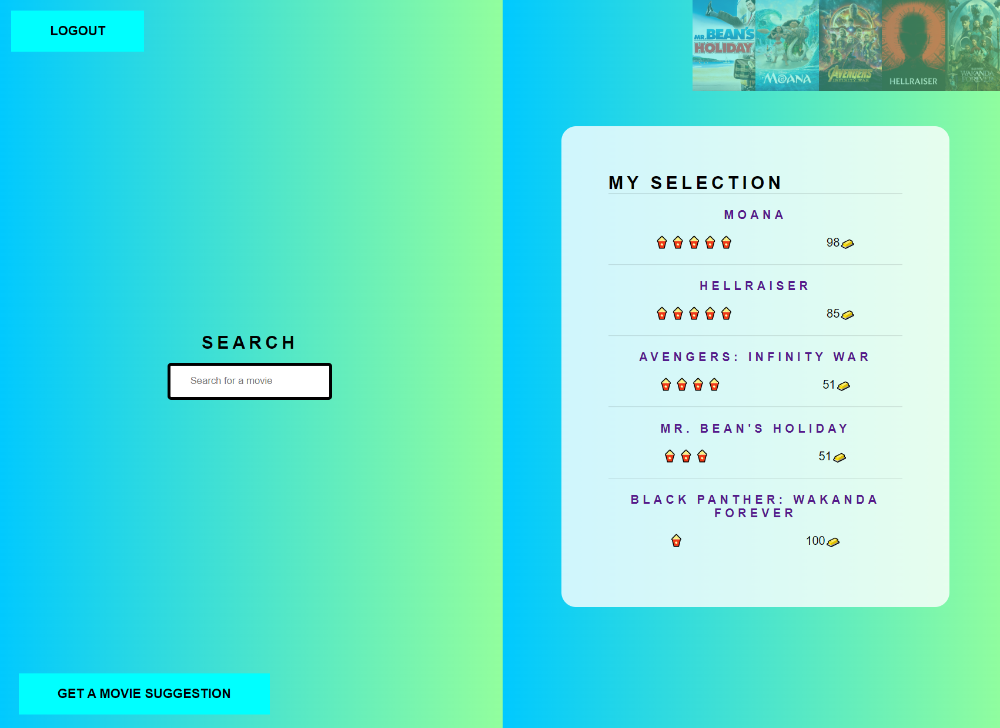

# Movie Rating API | Data Representation

<p align="center">
    
</p>

A movie rating website using python and javascript.

Live webiste from pythonanywhere.com:

http://cormbot.pythonanywhere.com/

### TL;DR

You'll need to create a config.py file to gain access to the third party API.

API keys can be created through [https://www.themoviedb.org/](https://www.themoviedb.org/)

```python
config = {
"movie_db_api_key": "<YOURAPIKEY>", 
"app_secret_key": "yourkey"
}
```

```python
pip install -r requirements.txt
python main.py
```
The site is hosted at:
[http://127.0.0.1:5000](http://127.0.0.1:5000)

## List of Technologies

- python
- flask
- mysqlAlchemy
- requests
- werkzeug.security


main.py is the entry point of application. This is where we create the app and run the main program. 

__init.py creates the database. This file creates the Flask application, sets up database, and handles auth middleware. In the html templates folder, we create html files using Jinja.

The views are served by routes.py through endpoints created in routes.py and auth.py. Jinja is a python html templating language which allows communication between python and html. 

auth.py creates the endpoints to serve the login page, logout the user, login the user. 

routes.py Serves the homepage and the movie rating page. Searching the third party API, rating the individual movies and removing rated movies are handled through POST requests.